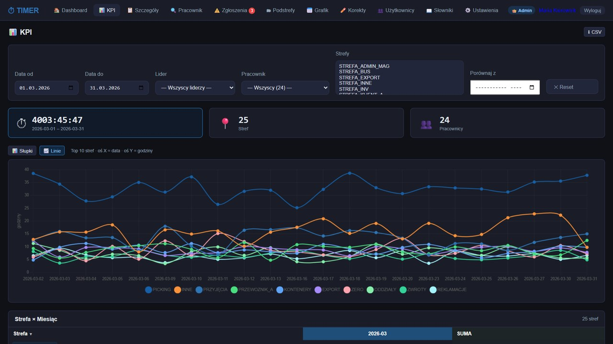

# TIMER — czas pracy w strefach magazynowych



Aplikacja Flask dla kierowników i liderów magazynu, która z eksportu zadań WMS liczy, ile czasu
każdy pracownik spędza w poszczególnych strefach — i pozwala pracownikom zgłaszać korekty.

> **Projekt portfolio.** Nazwy firm są zamienione na fikcyjne, a dane demo i testowe są syntetyczne.
>
> Kod udostępniony do wglądu (portfolio), wszelkie prawa zastrzeżone — patrz [`LICENSE`](LICENSE).
> Historia commitów została zgnieciona do jednego commita przy anonimizacji wersji portfolio.

[](https://github.com/TomaszWu14/rcp-strefy/actions/workflows/ci.yml)

Strefy to m.in. kompletacja, przyjęcia, wysyłki, inwentaryzacja. Kierownik widzi KPI całego
zespołu, lider — swój dział, pracownik — swoje dane; niezgodności zgłasza się w aplikacji
i akceptuje.

## W skrócie

| | |
|---|---|
| **Problem** | Czas pracy w strefach magazynu był liczony ręcznie z eksportów — bez wglądu dla pracowników i bez ścieżki korekt. |
| **Rozwiązanie** | Pipeline eksport → `czasy_calc.parquet` (odcinki pracownik × strefa × czas) + aplikacja z KPI, szczegółami, zgłoszeniami korekt z akceptacją i rolami. |
| **Stack** | Python, Flask, pandas + pyarrow (Parquet), openpyxl, werkzeug (hashowanie haseł), JS po stronie przeglądarki (wykresy). |
| **Jakość** | Testy zakresu uprawnień (`python -m unittest discover -s tests`): pracownik widzi tylko swoje dane, lider swój dział, kierownik wszystkich. |
| **Dane demo** | `tools/generate_demo_data.py` — 24 fikcyjnych pracowników, ~3 miesiące zmian, deterministyczne (stałe ziarno). |

## Uruchomienie

```bash
python -m venv .venv
.venv\Scripts\activate             # Linux/macOS: source .venv/bin/activate
pip install -r requirements.txt    # wersje przypięte jak w CI (Python 3.13)

python tools/generate_demo_data.py # dane demo do ./data (konta: hasło demo123)
set FLASK_DEBUG=1                  # Linux/macOS: export FLASK_DEBUG=1 (tryb demo, losowy klucz sesji)
python start.py                    # http://localhost:5000
```

Konta demo (z generatora): `admin` (kierownik), `kierownik`, `lider.kpl`, `lider.wys` oraz konta
pracowników, np. `JKOWALSKI` — wszystkie z hasłem `demo123`.
Bez danych demo (brak `data/users.json`) pierwszy start zakłada konto `admin`
z losowym hasłem wypisanym raz w konsoli.

Poza trybem demo klucz sesji jest wymagany: ustaw `FLASK_SECRET_KEY` (zob. `.env.example`),
inaczej aplikacja nie wystartuje. Nowe konta, reset hasła i import z Excela bez podanego
hasła dostają losowe hasło jednorazowe, pokazywane kierownikowi w komunikacie.

## Testy

```bash
python -m unittest discover -s tests
```

Testy generują dane demo do katalogu tymczasowego i sprawdzają widoczność danych
dla każdej roli (strony, eksport CSV, API, zgłoszenia).

## Mój wkład

Projekt w całości mojego autorstwa (jedyny twórca) — od analizy eksportu po wdrożenie w zespole.

- Pipeline `czasy_stref_pipeline.py`: z surowego eksportu zadań magazynowych składa odcinki
  pracownik × strefa × czas i zapisuje je do Parquet.
- Aplikacja z KPI, szczegółami, rozpisaniem podstref i ścieżką zgłoszeń korekt z akceptacją.
- Model ról (kierownik / lider / pracownik) z filtrowaniem danych w jednym miejscu (`scope_df`)
  i testami zakresu widoczności dla stron, eksportu CSV i API.
- Generator deterministycznych danych demo (24 fikcyjnych pracowników, ~3 miesiące).

## Dlaczego ten stack

Flask wystarcza na kilkanaście ekranów i jeden serwer w sieci firmowej — bez bazy i migracji.
Dane źródłowe to tabelaryczny eksport, więc naturalnym narzędziem jest pandas, a Parquet
(pyarrow) wczytuje kilka miesięcy odcinków w ułamku sekundy zamiast parsować XLSX przy każdym
żądaniu. Konta i zgłoszenia mieszczą się w plikach JSON, co upraszcza kopię zapasową
do skopiowania katalogu `data/`. openpyxl obsługuje import kont i eksport do Excela,
w którym zespół i tak pracuje.

## Ograniczenia i co dalej

- Pliki JSON zamiast bazy: brak blokad przy równoczesnym zapisie — przy większym zespole
  przejście na SQLite/PostgreSQL.
- Serwer deweloperski Flaska (`start.py`) w sieci wewnętrznej; do wystawienia na zewnątrz
  potrzebny WSGI (gunicorn/waitress) i HTTPS.
- `app.py` ma ~1600 linii — do podziału na blueprinty (KPI, zgłoszenia, użytkownicy).
- Testy pokrywają uprawnienia, nie obliczenia pipeline'u — brakuje testów na przypadki
  brzegowe (brak odbicia, zmiana strefy przez północ).
- Wykresy ładują Chart.js z CDN — offline nie działają.

## Gdzie zacząć czytać kod

1. [`app.py` — `get_role` i `scope_df`](app.py#L363) — role i filtrowanie danych wg zakresu.
2. [`czasy_stref_pipeline.py`](czasy_stref_pipeline.py) — od eksportu WMS do odcinków w Parquet.
3. [`tests/test_uprawnienia.py`](tests/test_uprawnienia.py) — co widzi każda rola.

## Wideo

Wkrótce (YouTube) — przegląd KPI, zgłoszenia korekty i rozpisania podstref.

## Role

| Rola | Zakres |
|---|---|
| kierownik | wszyscy pracownicy, akceptacja zgłoszeń, użytkownicy, słowniki, ustawienia |
| lider | pracownicy swojego działu |
| pracownik | własne dane i własne zgłoszenia |

## Zakładki

- **KPI** — wykresy i tabela sum per strefa per miesiąc
- **Szczegóły** — odcinki pracy z przyciskiem zgłoszenia niezgodności
- **Zgłoszenia** — formularz niezgodności (błędna strefa, brak odbicia, nadmiar czasu…) i akceptacja
- **Podstrefy** — rozpisanie czasu w strefach INNE/ZERO na czynności
- **Użytkownicy** — zakładanie kont, import z Excela, reset haseł (kierownik)

## Dane

| Plik | Zawartość |
|---|---|
| `data/czasy_calc.parquet` | odcinki: `data, pracownik, hu, strefa_docelowa, dt, dt_exit, czas_s` |
| `data/users.json` | konta (hasła jako hash werkzeug) |
| `data/zgloszenia.json` | zgłoszenia niezgodności |
| `data/podstrefy.json` | rozpisania podstref |

`czasy_stref_pipeline.py` buduje `czasy_calc.parquet` z eksportu zadań magazynowych
(XLSX) — w repo nie ma prawdziwego eksportu, do demo służy generator.
